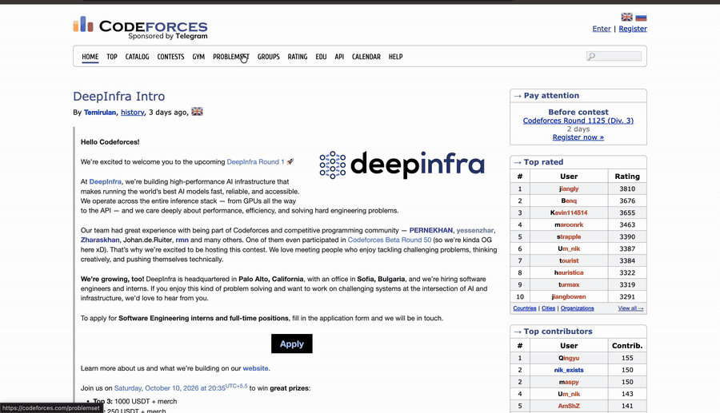

<h1>
  
  <span  style="position: relative; top: -8px;">CF_Peek</span>
</h1>

A Chrome extension that shows the editorial for the Codeforces problem you're
looking at in a pop-up, so you can check a hint without leaving the page or
hunting through a contest's blog post.

Open any problem, click **Editorial Quick View**, and the extension finds the
contest's tutorial, pulls out the section for that problem, and displays it
with math rendered and hints/solutions hidden until you click them.



## Features

- Works on `/problemset/problem/<contest>/<index>` and
  `/contest/<contest>/problem/<index>` pages.
- Extracts **only** the section for the current problem, even when a tutorial
  covers a whole round. `A` is never confused with `A1`/`A2`.
- Renders Codeforces math (`$$$inline$$$` and `$$$$$$display$$$$$$`) with KaTeX.
- Spoilers (hints, solutions) stay collapsed until you open them, with
  keyboard support.
- Clear loading and error states, including a link to the full tutorial when a
  section can't be found.
- Accessible modal: focus is trapped and restored, `Esc` closes it, and
  background scrolling is locked while it's open.
- Results are cached per page, so reopening is instant.

## Install (from source)

Requires Node.js 20+.

```bash
git clone https://github.com/Aditya1v/codeforces_extension.git
cd codeforces_extension
npm install
npm run build
```

Then in Chrome:

1. Open `chrome://extensions` and enable **Developer mode**.
2. Click **Load unpacked** and select this project folder.
3. Open any Codeforces problem and click the blue button in the bottom-right.

After changing the code, run `npm run build` again and click the reload icon
on the extension's card.

## Development

```bash
npm run build     # bundle src/ and copy public/ into dist/
npm test          # unit tests (Node's built-in test runner, no extra deps)
npm run package   # build and zip manifest.json + dist/ for the Chrome Web Store
```

### Project layout

```text
manifest.json        Manifest V3 definition
src/
  content.js         entry point: injects the button and wires everything up
  problemParser.js   contest id / problem index from a URL
  marker.js          detects where a problem's section starts and ends
  editorial.js       finds the tutorial link, fetches it, extracts the section
  sanitize.js        DOMPurify configuration for untrusted editorial HTML
  ui.js              modal: loading / content / error states, spoilers, a11y
public/              copied verbatim into dist/ (styles, icons, KaTeX)
test/                unit tests
```

### How it works

1. A content script runs on problem pages and adds the button.
2. On click it reads the sidebar's **Tutorial** link (preferring the English
   one) and fetches that blog post from the same origin.
3. It parses the post with `DOMParser`, finds the heading for
   `<contest><index>` (e.g. `1234A - Title`) and collects everything up to the
   next problem's heading.
4. Because that HTML is user-written, it is sanitised with
   [DOMPurify](https://github.com/cure53/DOMPurify) *before* it touches the
   page: scripts, event handlers, inline styles, forms and `javascript:` links
   are removed, and links open in a new tab with `rel="noopener noreferrer"`.
5. KaTeX renders the math and the result is shown in the modal.

## Limitations

- Editorials must label sections like `1234A - Title`, which is the standard
  Codeforces format. Tutorials written in another style show a message with a
  link to the full post instead.
- Tutorials hosted outside Codeforces can't be fetched from the page, so the
  extension links to them instead.

## Privacy

The extension collects no data and has no analytics. It makes a single request
per editorial, to the Codeforces tutorial page you're already allowed to open.

## License

[MIT](LICENSE)